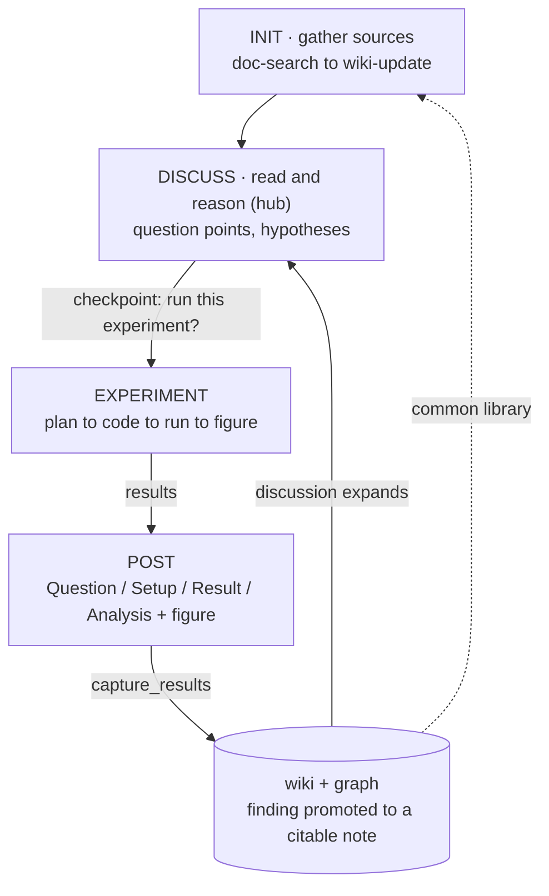
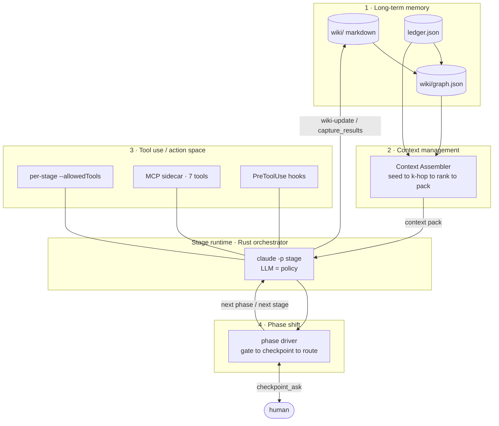
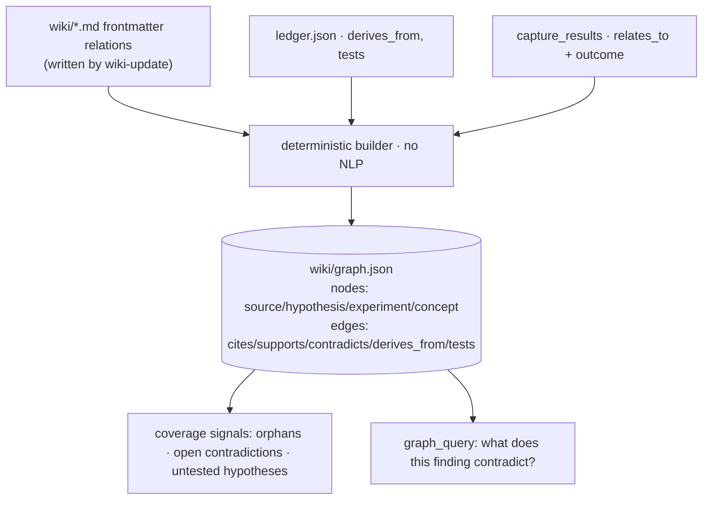
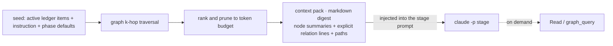
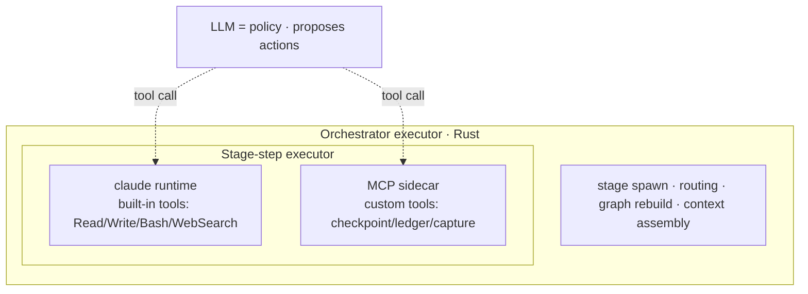
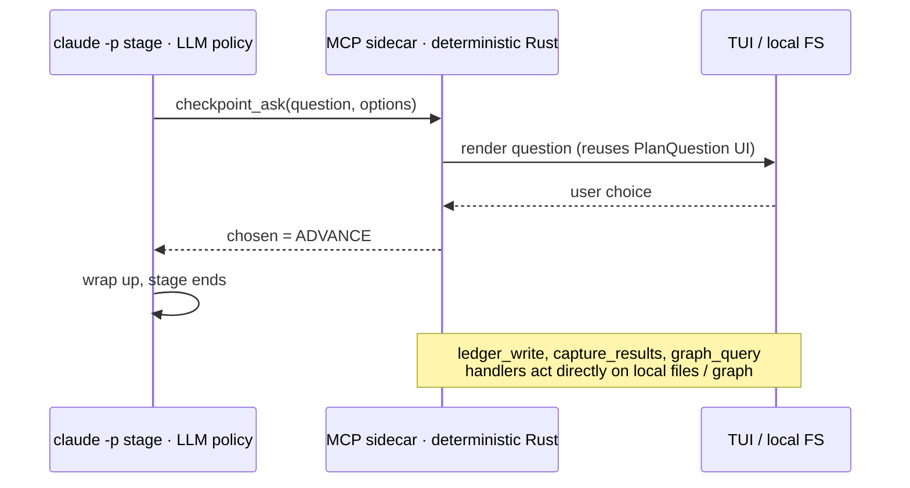
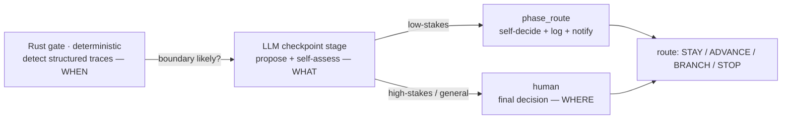
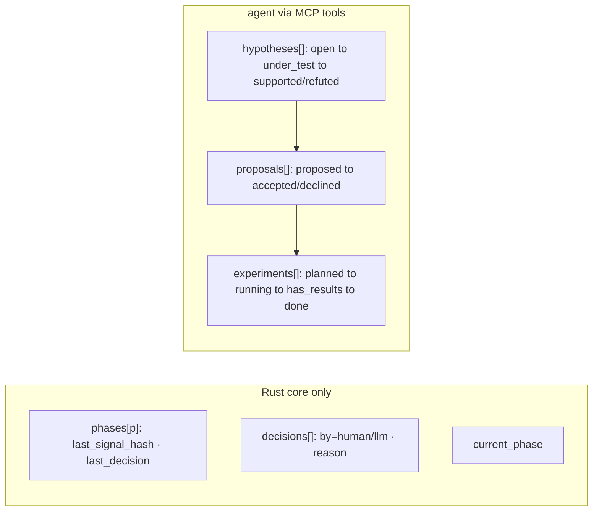
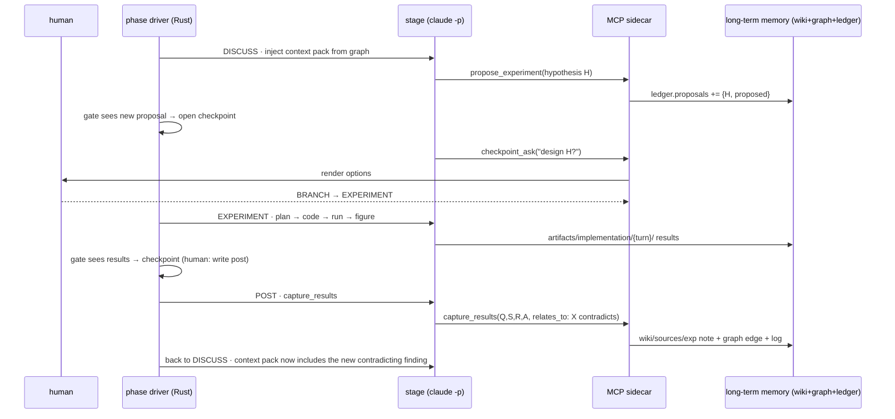

# research-os — Research Agent Architecture

> A design reference for the research agent: **what it is**, its **building blocks**
> (long-term memory, context management, tool use / action space, phase shift), and **how the
> whole architecture works** — captured in one at-a-glance master diagram plus per-block detail.
>
> Diagrams use [Mermaid](https://mermaid.js.org) and render as real figures on GitHub / VS Code.

---

## 1. What this agent is

research-os is a **local research orchestrator**. The only compiled component is a Rust TUI; the
reasoning comes from an external agent CLI (`claude -p`) spawned **once per stage**. Each stage
follows a natural-language **skill contract** and operates on a local, citation-aware **wiki**.

We define the research agent by its loop, not by a feature list:

> **A discussion centered on a continuously-updated wiki (the common library): start from an
> initial wiki built by literature gathering, read and reason with the agent to raise question
> points and hypotheses, validate promising hypotheses with toy experiments, write the result up
> as a post, fold that finding back into the wiki, and let the enriched library expand the next
> discussion.**

**Figure 1 — the research loop (the definition).**

- **DISCUSS is the hub.** The loop DISCUSS ⇄ EXPERIMENT → POST → FINDING repeats, thickening the wiki.
- A **post** = `(Question, Setup, Result, Analysis)` + figure. It is both the human-facing write-up
  and the body of an `experiment` note in `wiki/sources/`, so paper findings and your own
  experimental findings live in the **same** citable library.
- `writing` / `visualization` are **cross-cutting skills**, callable in any phase (not phases).

---

## 2. Architecture at a glance

The agent is built from four blocks wrapped around a single runtime spine (the Rust orchestrator
spawning a `claude -p` stage). The master diagram shows how they connect on every step.

**Figure 2 — master architecture (all four blocks + runtime + human).**

How to read it (one full step): the **phase driver (4)** picks a stage; the **Context Assembler (2)**
pulls a relevant slice of **long-term memory (1)** into a *context pack* injected into the stage; the
stage runs under a scoped **action space (3)** (allowed built-in tools + custom MCP tools + deny
hooks); its durable effects write back into long-term memory; then the driver computes an exit
signal and, at phase boundaries, asks the **human** (or self-routes for low-stakes) and shifts phase.

| Block | What it owns | Where it lives |
|---|---|---|
| **1 · Long-term memory** | durable knowledge + relationships + experiment state | `wiki/` (markdown) + `wiki/graph.json` (derived) + `ledger.json` |
| **2 · Context management** | what working context each stage starts with | Context Assembler (Rust), injected into the stage prompt |
| **3 · Tool use / action space** | what a stage is allowed to do, and who executes it | `--allowedTools` + MCP sidecar + PreToolUse hooks |
| **4 · Phase shift** | when to move between phases, and who decides | phase driver + `checkpoint_ask` / `phase_route` |

The agent loop is the classic **policy → executor → observation**: the LLM (inside a stage) is the
policy that *proposes* actions; deterministic executors (the claude runtime, the MCP sidecar, the
orchestrator) *carry them out*; results land in long-term memory and become the next observation.

---

## 3. Long-term memory management

Long-term memory is a **Karpathy-style markdown knowledge base** plus two derived/structured layers.
Markdown is always the source of truth; the rest is regenerable.

- **`wiki/` (markdown KB).** `sources/` (one note per paper or experiment), `concepts/`, `methods/`,
  `datasets/`, `entities/`, `comparisons/`, `synthesis/`, `outputs/`, plus `index.md`, `log.md`,
  `followups.md`. Invariants: sources are immutable after ingest; every non-trivial claim cites a
  `wiki/sources/` note; **only `wiki-update` (and the experiment `capture_results` path) mutate
  durable pages.**
- **`wiki/graph.json` (relationship graph, derived).** The knowledge graph is *latent* in the
  markdown (links, relationship verbs) and in the ledger (hypothesis ↔ source ↔ experiment). We
  **materialize** it into a derived index so it is queryable. Principle: a deterministic builder
  reads only **structured traces** — never prose. The fuzzy judgment ("this contradicts that") is
  made by the LLM in `wiki-update`, which writes a structured `relations` block; the builder reads it.
- **`ledger.json` (experiment / working state).** Hypotheses, proposals, experiments, decisions, and
  per-phase orchestration state. (Detailed in §5–§6.)

**Figure 3 — graph derivation (fuzzy judgment → structured trace → deterministic read).**

- **Nodes** (page/entity level): `source` (paper | experiment), `concept`, `method`, `dataset`,
  `entity`, `topic`, `synthesis`, `hypothesis`, `experiment`.
- **Edges**: `cites`, `supports` / `contradicts` / `refines` / `extends` / `duplicates`,
  `derives_from` (hypothesis←source), `tests` (experiment→hypothesis), `relates_to`+outcome
  (experiment finding→source), `about` (source→concept/method/dataset).
- The graph is rebuilt by a post-stage hook after any wiki mutation; it is a cache, never
  hand-edited (and can be gitignored). It powers **coverage/gap detection** (feeds §6 gates) and
  **discussion expansion** ("this new finding contradicts source X").

---

## 4. Context management (working memory)

Long-term memory drives short-term context. Instead of telling each stage "go read `index.md`
yourself," a **Context Assembler** (deterministic, Rust) selects the relevant subgraph and injects a
curated **context pack** into the stage prompt.

**Figure 4 — Context Assembler.**

- **Seed → k-hop → rank → pack.** Ranking score `f(distance from seed, edge weight [contradicts /
  supports > about], recency, centrality, phase relevance)`, pruned to a token budget.
- **Better than flat RAG:** relation edges (e.g. `contradicts`) are carried *into* the pack, so even a
  cold stage starts knowing the tensions in the library.
- **A pack is an entry point, not a wall:** the stage can `Read` a node's full page or call
  `graph_query` on demand. Avoids both context bloat and starvation.
- **Per-stage policy:** `doc-search` ≈ none; `discussion` = wide neighborhood of the topic + open
  contradictions + open hypotheses; `experiment` = active hypothesis + `derives_from` sources +
  similar past experiments; `capture` = `relates_to` targets; `wiki-update` = 1-hop of the page
  being updated + relation candidates.
- **Rust / LLM split:** building the graph, seeding, traversal, ranking, serialization, and injection
  are **deterministic (Rust)**; the only fuzzy input is the `relations` judgment made upstream by the
  LLM in `wiki-update`. (Optional: a small embedding/LLM pass can improve instruction→seed recall —
  that is the one place fuzziness is allowed.)
- Context is therefore **deterministic and inspectable** ("stage X was given these N nodes") and does
  **not** depend on conversation-history compaction: every stage is re-seeded from durable memory.

---

## 5. Tool use / action space

What a stage can *do* is a layered, per-stage **action space**, and the **executor** both performs and
enforces it. The LLM is the policy (proposes tool calls); deterministic executors actuate them.

**Figure 5 — executor (policy vs actuator).**

- **Boundary:** generic actions (file/code/web) are executed by the **claude runtime**; controlled,
  typed, domain actions are executed by a **local MCP sidecar** we run (deterministic Rust, *not* an
  LLM); macro actions (spawn stage, route phase) by the **orchestrator**.

The MCP sidecar exposes **7 custom tools** the stage may call (and waits synchronously for the reply):

| Tool | Role |
|---|---|
| `checkpoint_ask` | Ask the human a phase-transition question (blocking); reuses the existing PlanQuestion UI. |
| `ledger_read` / `ledger_write` | Read/write working memory (`ledger.json`); writes limited to content sections. |
| `capture_results` | Promote experiment output to a `(Q,S,R,A)` post = a citable `wiki/sources/` (type: experiment) note. |
| `propose_experiment` | Bridge DISCUSS→EXPERIMENT: record a hypothesis/proposal in the ledger. |
| `coverage_report` | Let the stage read the same exit-signal numbers the driver computed (gaps, coverage). |
| `phase_route` | Low-stakes self-routing without the human (granted only on low-stakes boundaries). |
| `graph_query` | Read-only graph queries (neighbors / contradictions / orphans / impact). |

**Figure 6 — a blocking custom-tool call (here, `checkpoint_ask`).**

**Per-stage action-space matrix (least privilege).** This table *is* how the invariants are enforced
in code:

| stage | built-in tools | MCP tools | writable paths |
|---|---|---|---|
| doc-search | WebSearch/Fetch, Bash(render/extract), Read, Write | ledger_read | raw/sources, artifacts/extracted·discovery, assets, manifest |
| wiki-update | Read,Write,Edit,Glob,Grep | ledger_read/write | **wiki/** (the only wiki writer) |
| discussion | Read,Glob,Grep | graph_query, ledger_read, propose_experiment, coverage_report, checkpoint_ask/phase_route | wiki/outputs/ only |
| experiment-planning | Read,Glob,Grep | graph_query, ledger_read/write | wiki/outputs/ (plan) |
| coding | Read,Write,Edit,Bash,Glob,Grep | ledger_read/write | **artifacts/implementation/{turn}/** only |
| visualization | Read,Write,Bash | ledger_read | assets/figures, artifacts/implementation/{turn} |
| capture (experiment-results) | Read | **capture_results**, ledger_write | (handler writes wiki/sources) |
| checkpoint (driver) | (Read) | checkpoint_ask, coverage_report, graph_query, [phase_route if low-stakes] | none |

**Enforcement mechanisms:** `--allowedTools` / `--disallowedTools` (built-in scope) +
`--strict-mcp-config` (which MCP tools are even visible) + PreToolUse hooks (path-level deny) +
`--permission-mode dontAsk`. Least privilege, the "only wiki-update/capture writes `wiki/`"
invariant, and "high-stakes always human" all hold **by construction**, not by trust.

---

## 6. Phase shift (loop control)

Phase transitions are neither a fixed loop, nor pure LLM autonomy, nor pure manual driving — they are
a **three-way relay**: *code lays the rails, the LLM raises a signpost, the human picks the direction.*

**Figure 7 — the control relay (who owns WHEN / WHAT / WHERE).**

- **Rust gate owns WHEN.** The phase graph is fixed. At each phase boundary `compute_exit_signal`
  checks only **structured facts** (file existence, ledger status, manifest fields) — it never judges
  quality. It detects *traces left by an upstream fuzzy judgment* (the LLM called
  `propose_experiment` → a proposal exists; coding produced files → results exist).
- **LLM owns WHAT.** Only once the gate opens does the LLM read `coverage_report` and *propose* a
  question, options, and a recommendation. It cannot decide a transition.
- **Human owns WHERE.** The human picks at the checkpoint; can hard-interrupt anytime.

**Gates as a state machine** (gate inputs are structured-only, hence deterministic):

| phase | structured gate | checkpoint question | routing |
|---|---|---|---|
| INIT | `manifest.venue_coverage` all `gap_reason==""` AND `wiki/sources/` ≥ min | "initial wiki sufficient — start discussion?" | ADVANCE→DISCUSS / STAY |
| DISCUSS (hub) | a **new** `proposals` entry with status=proposed + rough_design | "testable hypothesis H — design it?" | BRANCH→EXPERIMENT / STAY |
| EXPERIMENT | result files exist AND `experiments[id].status==has_results` | "results are in — write the post?" | ADVANCE→POST / STAY / BRANCH→DISCUSS(drop) |
| POST + capture | `capture_results` called → post_path + source_note AND status==done | "finding added — expand the discussion?" | ADVANCE→DISCUSS(loop closes) / BRANCH→EXPERIMENT / STOP |

- **DISCUSS is not a timer** — being the hub, you dwell freely; the checkpoint fires only when a
  hypothesis crystallizes (a `propose_experiment` call), not every turn.
- **No over-asking (hysteresis):** choosing STAY records `last_signal_hash`; the checkpoint does not
  re-fire until the signal *materially* changes (new source / hypothesis / result).

**Autonomy dial = LLM self-decision allowed, with stakes rails (enforced by tool-scoping):**

| | low-stakes (LLM may self-decide) | high-stakes (always human) |
|---|---|---|
| examples | INIT→DISCUSS, keep researching, STAY | start EXPERIMENT, **capture_results (wiki commit)**, STOP, drop an experiment |
| mechanism | `phase_route` **granted** in the checkpoint stage's allowedTools | `phase_route` **withheld** → only `checkpoint_ask` (human) is possible |

"High-stakes always human" is enforced by **withholding the `phase_route` tool**, not by trusting the
model. Every self-decision is logged to `ledger.decisions[].by:"llm"` with a reason and a
non-blocking TUI notification — local, logged, reversible (post-hoc veto).

**Working-memory ledger that drives the gates** (integrity rule: *orchestration state is not
agent-mutable*):

The `experiments`/`proposals` status lifecycle is exactly what the gates above read.

---

## 7. End to end — one research round

This single round exercises all four blocks: context is assembled from long-term memory, the action
space is scoped per stage, the new finding updates long-term memory (and the graph), and the phase
driver shifts phases with the human at the high-stakes boundaries.

---

## Appendix — implementation grounding

The agent is realized on a Rust TUI driving `claude -p` stages. Key anchors:

| Location | Role |
|---|---|
| `crates/research-os-cli/src/main.rs` | orchestrator: CLI/TUI, stage spawn (`build_agent_command`, `invoke_agent`), streaming, `validate_stage_output`, `session_stage_prompt` (context injection point), `execute_session_plan_tui` (generalized into the phase driver), `parse_plan_question`/`build_plan_question_lines` (reused for `checkpoint_ask`) |
| `skills/research-os-*/SKILL.md` | per-stage natural-language contracts |
| `schemas/*.schema.json` | stage artifact schemas (incl. `experiment_ledger`, `experiment_post`) |
| `wiki/` · `wiki/graph.json` · `ledger.json` | long-term memory (markdown source of truth + derived graph + working state) |
| MCP sidecar (local, in-process) | the 7 custom tools; the controlled-action executor |

**Constraints baked into the design:** local-first (all of `wiki`/`graph`/`ledger`/`artifacts` are
local files); a single Rust orchestrator with `claude -p` backends; and the action-space/executor
spine that makes least-privilege, the wiki-write invariant, and "high-stakes always human"
hold by construction.
