# research-os: 리서치 에이전트 아키텍처 보고서

> 이 문서는 research-os가 **현재 어떻게 동작하는지(as-is)**와, 이를 완성형 연구 루프로
> 확장하기 위해 설계한 **타깃 아키텍처(to-be)**를 처음 보는 사람도 이해할 수 있도록 정리한다.
> 그림은 [Mermaid](https://mermaid.js.org)로 작성되어 GitHub·VS Code 등에서 실제 도식으로 렌더된다.
>
> - **Part A. 현재 구현** — 코드에 실제로 존재하는 것.
> - **Part B. 타깃 아키텍처** — 설계했으나 아직 구현 전인 것(명확히 구분 표기).
> - **Part C. 현재 → 타깃 매핑 / 로드맵.**

---

## 0. 한눈에 보기

research-os는 **로컬 리서치 오케스트레이터**다. 컴파일되는 코드는 Rust TUI 하나뿐이고,
실제 "지능"은 외부 **에이전트 CLI**(`codex` 또는 `claude`)를 stage마다 서브프로세스로 띄워서 얻는다.
각 stage는 자연어 **skill 계약**(`skills/*/SKILL.md`)을 따라, 원천 자료를 인용 가능한
**wiki(공통 라이브러리)**로 바꾸고, 그 wiki를 다시 하위 연구 작업(Q&A·합성·작성·실험계획 등)에 재사용한다.

핵심 비전을 한 문장으로:

> **"wiki(common library)를 중심으로 도는 discussion, 그리고 그 discussion이 낳은 가설을
> toy experiment로 검증해 다시 wiki로 되먹이는 연구 루프."**

현재 구현은 이 루프의 **앞쪽 절반(자료조사 → wiki)**만 갖췄고, 뒤쪽 절반(토의 → 실험 → 결과정리 →
wiki 되먹임 → 반복)은 비어 있다. Part B가 그 공백을 메우는 설계다.

---

# Part A. 현재 구현 (as-is)

## A.1 큰 그림

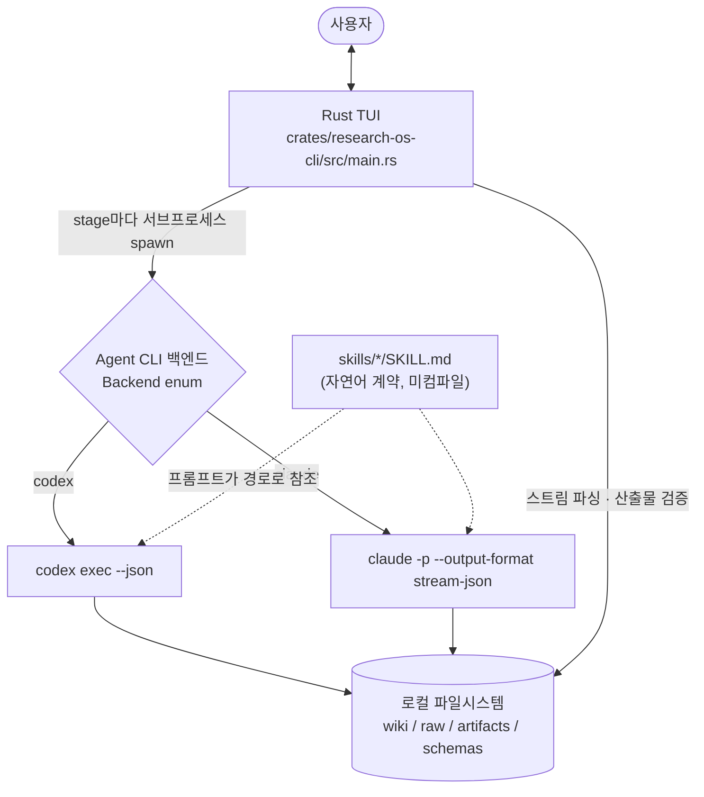

- **TUI(Rust)**: CLI 디스패치 + ratatui/crossterm UI(패널: Conversation / Pipeline / Artifacts) +
  세션/런 라이프사이클 + 서브프로세스 스폰·스트리밍 + 산출물 검증. 거의 전부가 `main.rs`(약 5k 줄) 한 파일.
- **에이전트 백엔드**: `Backend` enum으로 codex/claude 선택. `RESEARCH_OS_AGENT=claude|codex`로 초기값,
  TUI `/agent` 명령으로 런타임 전환. TUI 자체는 LLM 로직을 돌리지 않는다 — 전적으로 백엔드에 위임.
- **skill**: 마크다운 + YAML frontmatter 계약. 편집하면 재컴파일 없이 에이전트 행동이 바뀐다.

## A.2 한 stage가 실행되는 방식 (에이전트 harness)

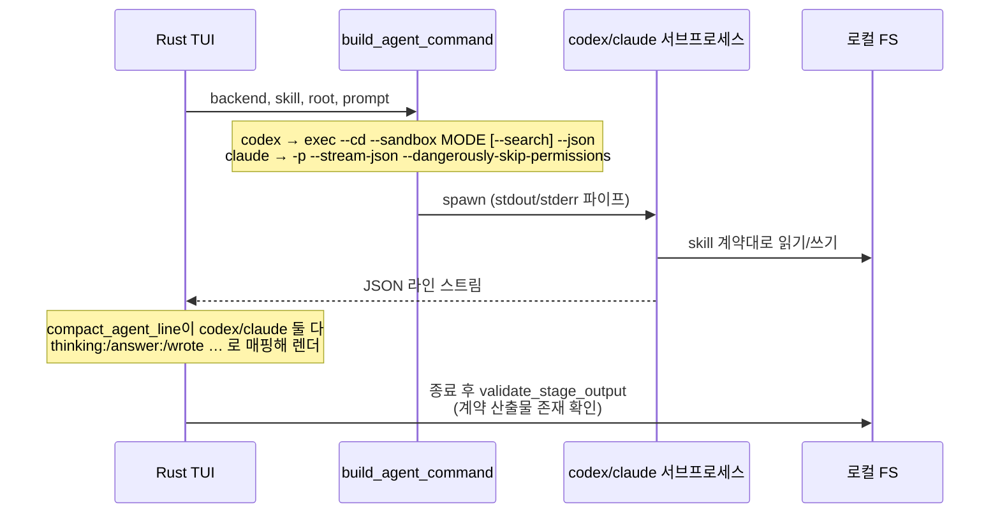

코드 기준점(대략적 위치, 코드 이동 가능):

| 책임 | 함수 (`main.rs`) |
|---|---|
| 백엔드별 커맨드 조립 | `build_agent_command` (≈4002) |
| codex sandbox 모드 결정 | `agent_sandbox_mode` (≈4224) — doc-search/search/ingest만 `danger-full-access`, 나머지 `workspace-write` |
| codex 웹검색 플래그 | `agent_needs_search` (≈4235) — 동일 3개만 `--search` |
| 서브프로세스 스폰·스트리밍 | `invoke_agent`(≈4042) / `invoke_agent_tui`(≈4085) |
| 스트림 라인 → 표시 어휘 | `compact_agent_line` / `compact_claude_line` (≈4295~) |
| 산출물 계약 검증 | `validate_stage_output` (≈4590) |

> **claude 백엔드 주의점**: 모든 stage가 `--dangerously-skip-permissions`로 실행된다. `-p`(print)
> 모드가 대화형 권한 프롬프트에 답할 수 없기 때문. → **per-skill 툴 제어·불변식 강제가 0**(공백 #4).

## A.3 turn 모델과 파이프라인

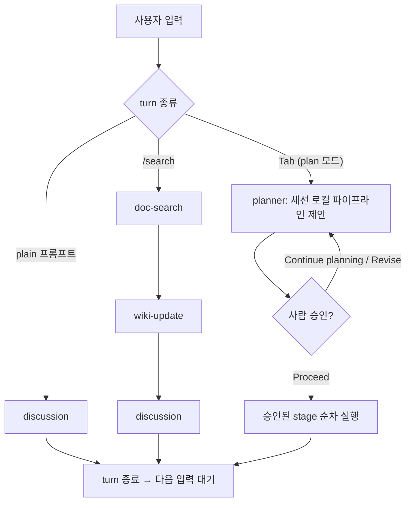

- **고정 단일 패스**다. Discussion=1 stage, Search=3 stage 고정, Plan=planner 후 승인 시 실행.
- 반복(루프)·phase·중간 checkpoint 개념이 없다 → **반복은 100% 사람 손**(공백 #2).
- plan 모드는 유일한 "에이전트 제안 → 사람 확정" 상호작용: 에이전트가 출력 스트림에
  `PLAN_CONFIRM: 질문 || 옵션1 || 옵션2 …`를 뱉으면 `parse_plan_question`(≈4270)이 파싱하고
  `build_plan_question_lines`(≈2272)가 선택지로 렌더한다. **(이 메커니즘은 Part B에서 재사용된다.)**

관련 함수: `run_session_turn_tui`(≈3364), `execute_session_plan_tui`(≈3505),
`session_turn_stages`(≈3901), `session_stage_prompt`(≈3959).

## A.4 wiki — 장기기억 (공통 라이브러리)

Karpathy 스타일 마크다운 지식베이스. **graph DB·임베딩 없음** — 순수 마크다운 파일 + 링크 + frontmatter.

```
sessions/{id}/wiki/
  index.md       # 카탈로그 + 한 줄 요약 (지식-사용 stage가 먼저 읽음)
  log.md         # append-only 변경 이력
  followups.md   # 미해결 질문 · 약한 증거 · gap
  sources/       # 소스당 구조화 노트 1개 (논문 등; ingest 후 불변)
  concepts/ entities/ methods/ datasets/ comparisons/   # 재사용 지식
  synthesis/     # 교차-소스 트렌드/갈등/gap (사람용)
  outputs/       # 사람용 durable 출력 (Q&A·토의·계획)
```

**핵심 불변식(`AGENTS.md`)**: 원천은 ingest 후 불변 / 모든 비자명 기술 주장은 `wiki/sources/`를
인용 / **기본적으로 `wiki-update` skill만 durable wiki를 변경** / 지식-사용 skill은 답하기 전
`index.md`를 먼저 읽고, 근거 부족 시 모른다고 말한다.

스키마: `schemas/*.schema.json`(plan, doc_search_manifest, ingest_manifest 등)이 stage 산출물을 규정.

## A.5 용어 주의 — sessions vs runs

- `sessions/{id}/` — 현재 사용자 대면 워크스페이스(README·skill이 쓰는 용어). `turns.jsonl`, `plan/`,
  `transcripts/`, `raw/sources/`, `artifacts/`, `wiki/`, `schemas/` 보유.
- `runs/{id}/` — 그 아래 per-pipeline-execution 단위(`AGENTS.md`가 쓰는 옛 용어). run wiki는 세션으로 동기화.
- 두 용어가 코드·문서에 혼재한다(표류). 새 작업은 `sessions/` 경로 기준.

## A.6 현재 구조의 4대 공백

| # | 공백 | 근거 |
|---|---|---|
| 1 | **끊긴 post→DB 엣지** | `coding`/`experiment-planning` 산출물이 `artifacts/implementation/{turn}/`에 고이고 끝. wiki로 승격하는 경로 없음. |
| 2 | **반복/phase/checkpoint 부재** | 모든 turn이 고정 linear 단일 패스(`session_turn_stages`). 반복=사람 손. |
| 3 | **working-context 층 부재** | stage마다 새 서브프로세스 + 정적 프롬프트가 "index.md 직접 읽어라"만. 누적·관리되는 에이전트 상태 없음. |
| 4 | **tool-use 스코핑 부재** | codex는 sandbox on/off만; claude는 전부 bypass-permissions → per-skill 제어·불변식 0. |

> agentic loop 3요소로 보면: **memory(wiki)는 훌륭**하나, **context(working memory)와 tool-use가
> 사실상 비어 있고, 루프를 *도는* 제어층이 없다.** Part B가 이를 메운다.

---

# Part B. 타깃 아키텍처 (to-be · 설계, 구현 전)

> 제약(사용자 확정): **local-first 못 양보**(wiki/artifacts/ledger는 로컬 파일; Managed Agents 제외) ·
> **Rust 단일 바이너리 오케스트레이터 유지**(백엔드는 stage별 `claude -p`) ·
> **자율 다이얼 = LLM 자가결정 허용 + stakes 레일**(아래).
>
> Phase 0 검증 완료: `--allowedTools`/`--disallowedTools`, 로컬 stdio `--mcp-config`, PreToolUse 훅
> (deny 가능), MCP 툴 동기 차단(사람 대기 패턴) 모두 헤드리스 `claude -p`에서 성립. 단
> `--permission-prompt-tool`은 experimental → `--permission-mode dontAsk`+allowedTools+훅으로 대체.

## B.1 연구 루프 = phase 그래프 (닫힌 루프)

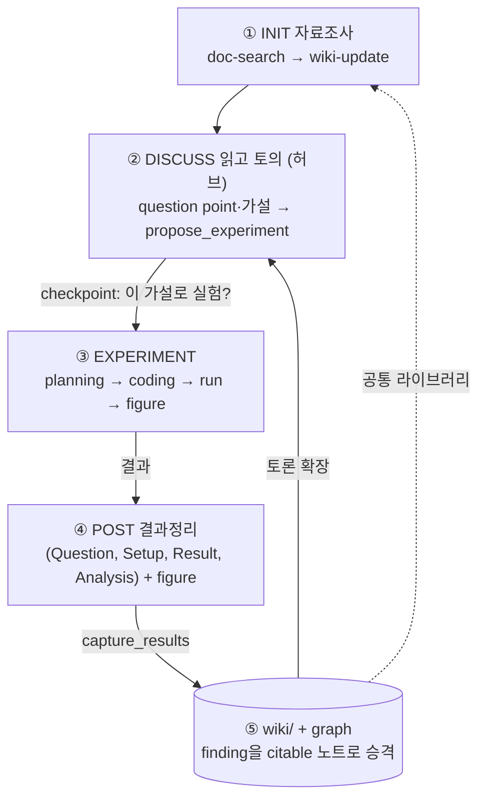

- **DISCUSS가 허브**, ②⇄③⇄④⇄⑤가 반복하며 wiki가 두꺼워진다.
- **post = `(Question, Setup, Result, Analysis)` + figure** — 끊겼던 post→DB 엣지를 닫는 산출물이자
  `wiki/sources/`의 experiment 노트 본문. 논문 finding과 실험 finding이 같은 wiki에 공존.
- `writing`/`visualization`은 phase가 아니라 **cross-cutting skill**(어느 phase에서든 호출).

## B.2 타깃 전체 아키텍처

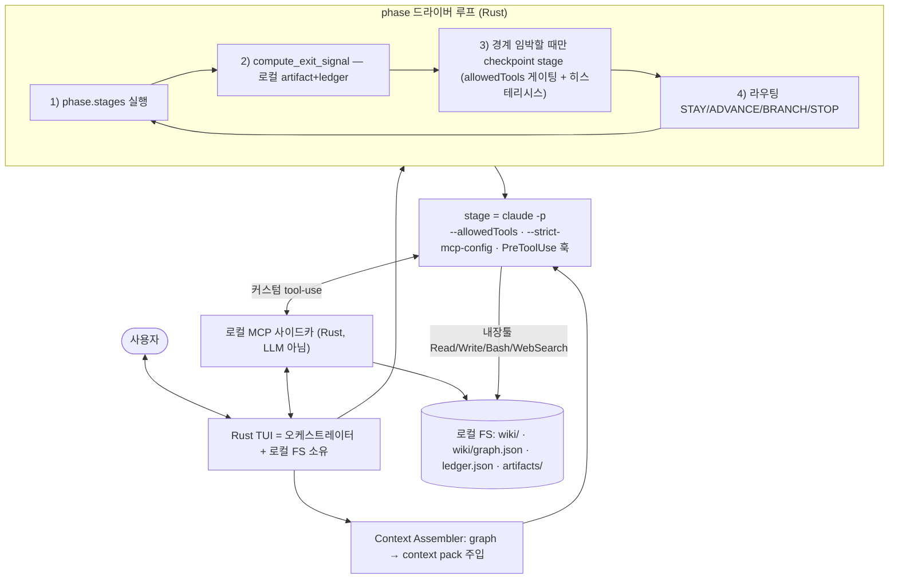

agentic loop 3요소 매핑:

| 요소 | 현재 | 타깃 |
|---|---|---|
| **memory (장기)** | wiki 마크다운 ✅ | 그대로 유지 ✅ |
| **context (working)** | 없음 ⚠️ (콜드스타트+index.md) | **graph 기반 context pack** (Context Assembler) ✅ |
| **tool-use** | sandbox on/off만 ⚠️ | **per-stage `--allowedTools` + MCP 커스텀툴 + 훅** ✅ |
| **loop 제어** | 없음 ❌ | **phase 드라이버 + checkpoint** ✅ |

## B.3 제어 모델 — "코드가 깐 레일 위에서, LLM이 표지판을 세우고, 사람이 방향을 고른다"

phase 전이는 fixed loop도, 순수 LLM 자율도, 순수 수동도 아닌 **3자 분업**이다.

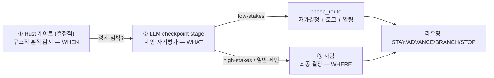

- **Rust(언제 묻나)**: phase 그래프는 고정. 매 phase 끝에 `compute_exit_signal`로 **구조적 게이트**만
  결정적으로 계산 → 참일 때만 checkpoint stage를 띄운다. *품질("충분한가")은 판단하지 않고*,
  상류 fuzzy 판단이 남긴 **구조화된 흔적**(파일 존재·ledger status·manifest 필드)만 감지한다.
- **LLM(무엇을 제안)**: 게이트가 열리면 그제서야 `coverage_report`로 같은 숫자를 읽고
  질문·선택지·추천을 *제안*한다. 전이를 *결정*하진 못한다.
- **사람(어디로)**: checkpoint에서 최종 선택. 언제든 하드 인터럽트 가능.

**과잉 질문 방지 = 히스테리시스**: STAY를 고르면 ledger에 `last_signal_hash`를 기록하고, 신호가
*유의미하게* 바뀌기 전엔 다시 묻지 않는다.

**자율 다이얼 = LLM 자가결정 허용 + stakes 레일**(코드로 강제):

| | low-stakes (LLM 자가결정 허용) | high-stakes (항상 사람) |
|---|---|---|
| 예 | INIT→DISCUSS, research 계속, STAY | EXPERIMENT 시작, **capture_results(=wiki commit)**, STOP, 실험 폐기 |
| 메커니즘 | checkpoint stage allowedTools에 `phase_route` **부여** | `phase_route` **미부여** → `checkpoint_ask`(사람)만 가능 |

> "고위험 항상 사람"이 LLM의 선의가 아니라 **허용 툴에서 phase_route를 빼는 것**으로 강제된다.
> 자가결정은 `ledger.decisions[].by:"llm"` + 사유 로그 + TUI 비차단 알림 → 사후 veto 가능(local·가역).

## B.4 로컬 MCP 사이드카 — claude가 부르는 "전용 콘솔"

사이드카 = research-os가 in-process로 띄우는 작은 MCP 서버. **LLM이 아니라 결정적 코드.** claude의
*커스텀* tool-use 요청만 받아 실행·반환한다(내장툴은 claude 런타임이 자체 처리).

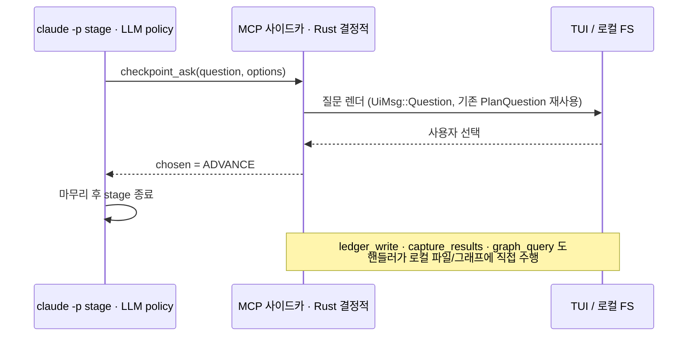

**7개 툴**:

| 툴 | 역할 |
|---|---|
| `checkpoint_ask` | 일반화된 PLAN_CONFIRM. 사람에게 phase 전이 질문(차단형). |
| `ledger_read`/`ledger_write` | 영속 working memory(ledger.json) 읽기/쓰기. write는 내용 섹션만. |
| `capture_results` | **끊긴 post→DB 엣지**. 실험 결과를 (Q,S,R,A) post = wiki/sources(type:experiment)로 승격. |
| `propose_experiment` | discussion→experiment 다리. 가설을 ledger.proposals에 기록. |
| `coverage_report` | Rust가 계산한 exit signal을 agent가 읽음(gap·커버리지). |
| `phase_route` | low-stakes 자가결정(사람 없이). high-stakes엔 미부여. |
| `graph_query` | 읽기전용 wiki 관계 그래프 질의(neighbors/contradictions/impact…). |

## B.5 ledger — 관리되는 working memory

`ledger.json`(신규 `schemas/experiment_ledger.schema.json`). **무결성 핵심: 오케스트레이션 상태는
agent가 못 바꾼다.**

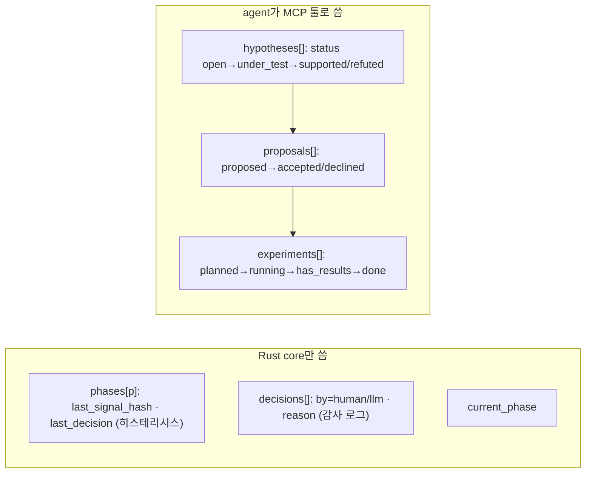

status 라이프사이클이 phase 게이트와 직결: DISCUSS=`proposals.any(proposed)`,
EXPERIMENT=`experiments.any(has_results)`, POST=`experiments.any(done && source_note_path)`.

## B.6 wiki 관계 그래프 — 잠재된 엣지를 materialize

현재 wiki는 graph가 아니다(마크다운+링크+프로즈). 하지만 엣지 정보(인용·supports/contradicts·
가설↔소스·실험↔소스)는 이미 적히고 있다. → **마크다운+ledger = 진실원천, `wiki/graph.json` =
파생 인덱스**로 그래프를 추가(local-first 유지).

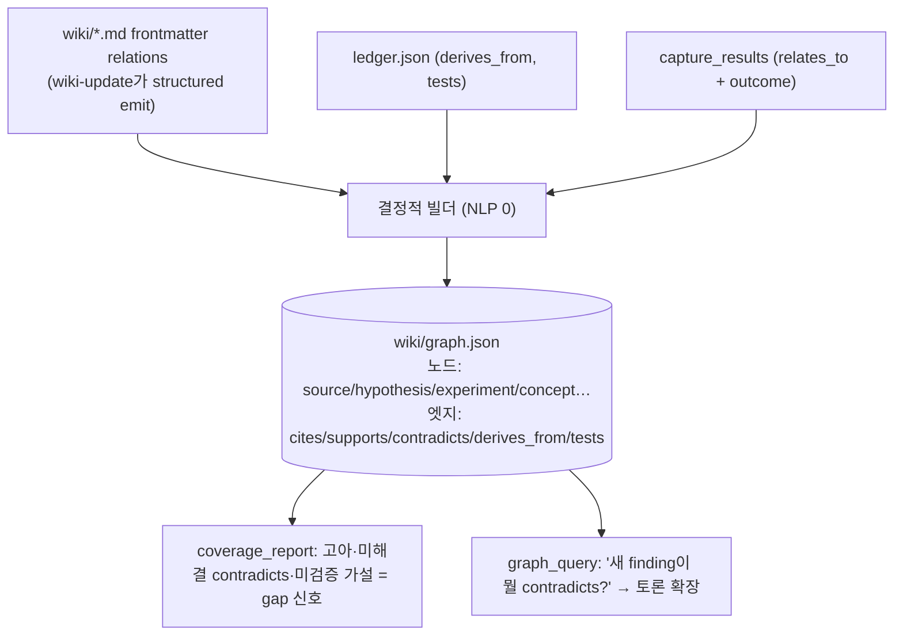

원칙은 동일: **fuzzy 판단(LLM이 `relations`를 씀) → structured 흔적(graph.json) → 결정적 읽기(빌더).**
wiki 변경 stage 직후 post-stage 훅이 graph.json을 재생성(손으로 안 고침, gitignore 가능).

## B.7 graph 기반 working-context 관리 (Context Assembler)

비었던 working-context 층을 **장기기억(graph)이 메운다.** stage를 띄우기 전, Rust가 그래프에서
관련 subgraph를 뽑아 **context pack**을 프롬프트에 주입한다 — "index.md 직접 읽어라"를 대체.

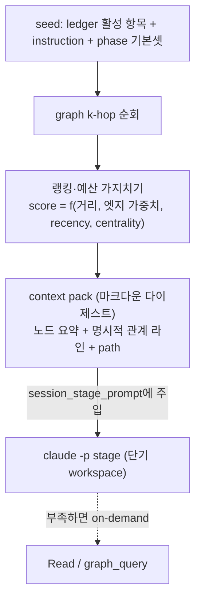

- **flat RAG보다 나은 점**: 엣지(contradicts 등)를 pack에 명시 → 콜드 stage도 모순을 알고 시작.
- **pack은 진입 컨텍스트지 벽이 아님**: stage가 필요하면 전체 페이지를 Read로 보강.
- **Rust/LLM 분업**: 빌드·seed·순회·랭킹·직렬화·주입 = Rust(결정적); 관계 판단 = LLM(wiki-update).
  정직한 예외: instruction→seed 의미매칭만 fuzzy 여지(기본 결정적 키워드; 선택적 임베딩 보강).

## B.8 Action space + Executor — 통제 척추

에이전트가 "할 수 있는 것"은 3층이고, executor가 그것을 *강제*한다.

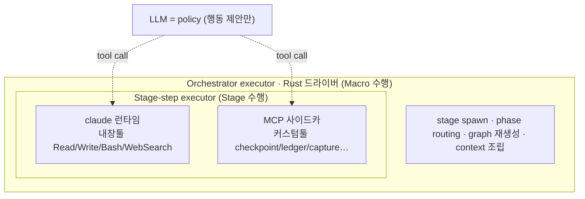

**per-stage action space 매트릭스(최소권한)** — 이것이 곧 불변식의 구체적 강제다:

| stage | 내장툴 | MCP툴 | 쓰기 경로 |
|---|---|---|---|
| doc-search | WebSearch/Fetch, Bash(render/extract), Read, Write | ledger_read | raw/sources, artifacts/extracted·discovery, assets, manifest |
| wiki-update | Read,Write,Edit,Glob,Grep | ledger_read/write | **wiki/** (유일 wiki 작성자) |
| discussion | Read,Glob,Grep | graph_query, ledger_read, propose_experiment, coverage_report, checkpoint_ask/phase_route | wiki/outputs/ 만 |
| experiment-planning | Read,Glob,Grep | graph_query, ledger_read/write | wiki/outputs/(plan) |
| coding | Read,Write,Edit,Bash,Glob,Grep | ledger_read/write | **artifacts/implementation/{turn}/** 만 |
| visualization | Read,Write,Bash | ledger_read | assets/figures, artifacts/implementation/{turn} |
| capture(experiment-results) | Read | **capture_results**, ledger_write | (핸들러가 wiki/sources 작성) |
| checkpoint(드라이버) | (Read) | checkpoint_ask, coverage_report, graph_query, [phase_route 저위험만] | 없음 |

**강제 수단**: `--allowedTools`/`--disallowedTools`(내장 스코프) + `--strict-mcp-config`(MCP 노출) +
PreToolUse 훅(경로 deny) + `--permission-mode dontAsk` + stakes(phase_route 부여/박탈).
→ 최소권한 · "wiki는 wiki-update/capture만" 불변식 · "고위험 항상 사람"이 전부 코드로 보장된다.

---

# Part C. 현재 → 타깃 매핑 / 로드맵

## C.1 무엇이 재사용되고 무엇이 신규인가

| 타깃 구성요소 | 현재에서 | 신규/변경 |
|---|---|---|
| 백엔드·스트리밍·검증 | `build_agent_command`·`invoke_agent`·`validate_stage_output` 재사용 | — |
| checkpoint 렌더 | `parse_plan_question`·`build_plan_question_lines` 재사용 | 텍스트 마커 → MCP 호출로 공급 |
| phase 드라이버 | `execute_session_plan_tui` 일반화 | + `compute_exit_signal` + 라우팅 + 히스테리시스 |
| context 주입 | `session_stage_prompt` | "index.md 읽어라" → context pack 주입 |
| 툴 스코핑 | bypass-permissions 제거 | per-stage allowedTools + dontAsk + 훅 |
| MCP 사이드카·ledger·graph·Context Assembler | — | 전부 신규 |

## C.2 점진 로드맵

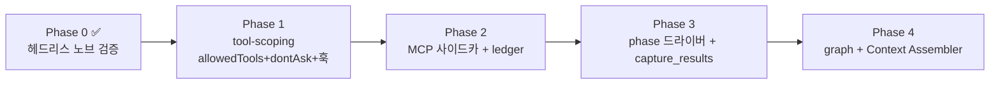

- **Phase 0 (완료)**: 헤드리스 노브 성립 확인. `--permission-prompt-tool`만 dontAsk+allowedTools+훅으로 교체.
- **Phase 1**: claude 백엔드 bypass-permissions 제거 → per-stage allowedTools + dontAsk + PreToolUse 훅.
  codex는 거친 fallback 유지.
- **Phase 2**: 로컬 stdio MCP 사이드카(`--strict-mcp-config`) + 7 툴. ledger/post 스키마.
- **Phase 3**: phase 드라이버 루프 + exit signal + 히스테리시스. `capture_results`로 post→wiki 엣지 연결.
- **Phase 4**: graph 빌더 + 재생성 훅 + `graph_query` + wiki-update의 `relations` emit + Context Assembler.

## C.3 검증(end-to-end)

- `cargo build -p research-os-cli` / `cargo clippy`.
- 한 라운드 수동 추적: INIT → DISCUSS(가설→propose_experiment) → checkpoint로 EXPERIMENT 분기 →
  coding → capture_results → wiki/sources에 experiment 노트 + graph.json에 contradicts 엣지 →
  DISCUSS 복귀 시 context pack에 그 노트/엣지가 주입돼 인용하는지.
- 불변식(훅): wiki-update/capture 외 stage가 wiki/를 못 건드림; high-stakes에 phase_route 미부여.
- 자율 레일: low-stakes 자가결정이 `decisions[].by:"llm"` 로그 + TUI 알림으로 관측되는지.

---

## 부록. 주요 파일·함수 레퍼런스

| 위치 | 내용 |
|---|---|
| `crates/research-os-cli/src/main.rs` | 전부(CLI·TUI·오케스트레이션·백엔드 스폰·검증). 약 5k 줄 단일 파일 |
| `skills/research-os-*/SKILL.md` | 에이전트 자연어 계약(16개 활성 + deprecated 4개) |
| `schemas/*.schema.json` | stage 산출물 스키마(plan, doc_search_manifest, …; 타깃: experiment_ledger, experiment_post) |
| `scripts/` | out-of-process 헬퍼(`render_source_page.mjs`, `extract_pdf_assets.py`) |
| `AGENTS.md` | 권위 있는 에이전트 규칙·불변식(runs/ 용어) |
| `CLAUDE.md` | 아키텍처·TUI 모델·백엔드 선택 |
| `docs/research-agent-architecture.md` | (이 문서) |

> **요약**: 현재 research-os는 *마크다운 wiki를 잘 쌓는 단일-패스 파이프라인*이다. 타깃은 그 위에
> **로컬 MCP 사이드카 + phase 드라이버 + 관계 그래프 + graph 기반 context**를 얹어, *사람이 클릭으로
> 운전하는 닫힌 연구 루프*로 만든다 — memory(wiki)는 그대로 두고, 비어 있던 context·tool-use·loop 제어
> 층을 채우는 일이다.
