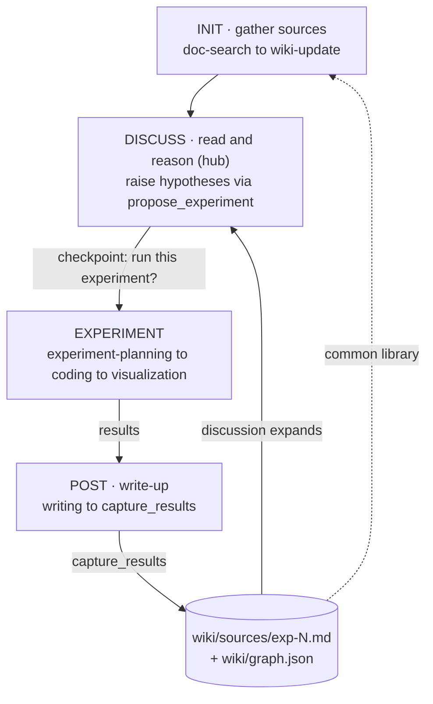
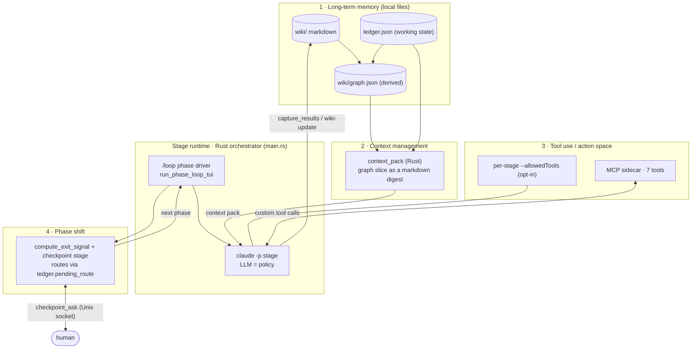
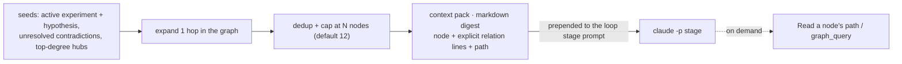
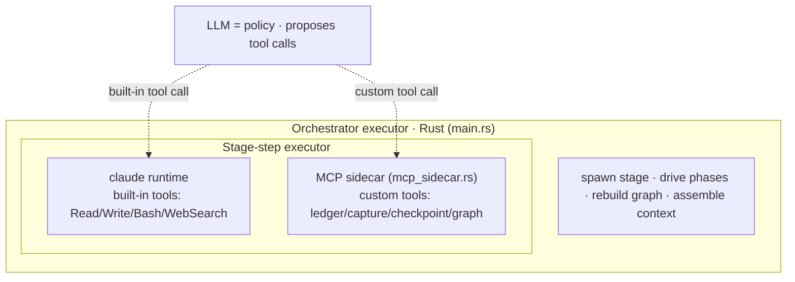
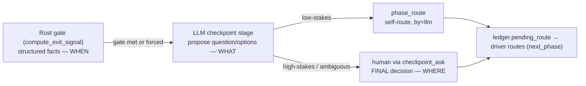
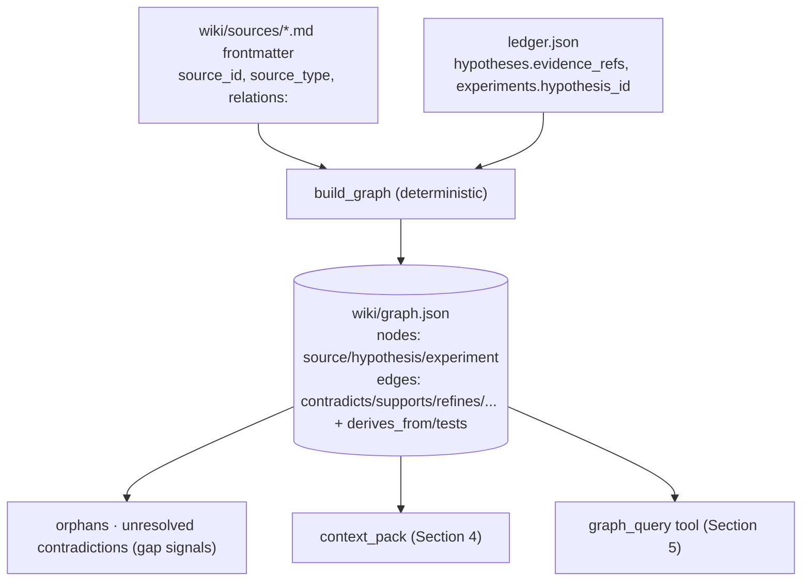
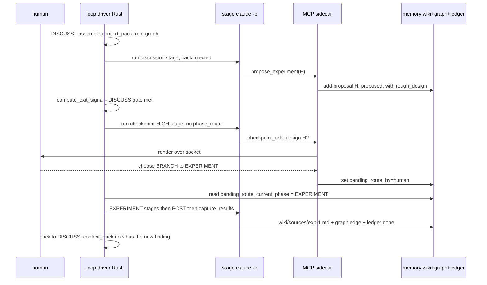

# research-os — Research Agent Architecture (as built)

> This document describes the research agent **as implemented** on the
> `feat/research-loop` branch: what it is, its building blocks, and how the whole
> system works. Where the implementation is deliberately a simpler v1 of a richer
> design, that is called out in **§9 Designed but not yet built** — so the figures
> and prose here match the actual code, not an aspiration.
>
> Diagrams use [Mermaid](https://mermaid.js.org) and render as real figures on
> GitHub / VS Code.

---

## 1. What this agent is

research-os is a **local research orchestrator**. The only compiled component is
a Rust TUI; the reasoning comes from an external agent CLI (`claude -p`, or
`codex`) spawned **once per stage**. Each stage operates on a local,
citation-aware **wiki**.

The agent is defined by its loop:

> **A human-steered loop centered on a wiki (the common library): gather sources
> into an initial wiki, read and reason to raise hypotheses, validate a promising
> hypothesis with a toy experiment, promote the finding back into the wiki as a
> citable note, and let the enriched library expand the next round.**

The `/loop <subject>` command runs exactly this loop (§6).

**Figure 1 — the closed research loop (the four phases).**



---

## 2. Architecture at a glance

Four building blocks wrap a single runtime spine (the Rust orchestrator spawning
a `claude -p` stage). The master diagram shows how they connect on every step.

**Figure 2 — master architecture (as built).**



| Block | What it owns | Where it lives |
|---|---|---|
| **1 · Long-term memory** | durable knowledge + relationships + loop state | `wiki/` markdown + `wiki/graph.json` (derived) + `ledger.json` — all local |
| **2 · Context management** | what working context each loop stage starts with | `graph::context_pack`, injected into the loop stage prompt |
| **3 · Tool use / action space** | what a stage may do, and who executes it | `--allowedTools` (opt-in) + the MCP sidecar |
| **4 · Phase shift** | when to move phases, and who decides | the `/loop` driver + a stakes-gated checkpoint stage |

The agent loop is the classic **policy → executor → observation**: the LLM (inside
a stage) proposes actions; deterministic executors (the claude runtime, the MCP
sidecar, the Rust orchestrator) carry them out; results land in long-term memory
and become the next observation.

**Modules (Rust):** `main.rs` (orchestrator, TUI, driver, tool-scoping,
checkpoint socket), `ledger.rs` (working state), `phase.rs` (phase decision
logic), `mcp_sidecar.rs` (the 7 MCP tools), `checkpoint_ipc.rs` (Unix-socket
transport), `graph.rs` (relationship graph + context pack).

---

## 3. Long-term memory

Three local layers; markdown + ledger are the source of truth, the graph is a
regenerable cache.

- **`wiki/` (markdown KB).** `sources/` (one note per paper or experiment),
  `topics/`, `concepts/`, `synthesis/`, `outputs/`, plus `index.md`, `log.md`,
  `followups.md`. Experiment findings land here as `wiki/sources/exp-N.md` notes
  with `source_type: experiment`, so paper findings and your own experimental
  findings live in the **same** citable library.
- **`ledger.json` (working state).** `current_phase`, `subject`, `phases` (per-phase
  hysteresis bookkeeping), `decisions` (audit log), `pending_route` (the route a
  checkpoint produced, consumed by the driver), and the content sections
  `hypotheses` / `proposals` / `experiments`. Modeled in `ledger.rs`.
- **`wiki/graph.json` (derived relationship graph).** Built deterministically from
  structured traces only (see §7); rebuilt after a `capture_results` and each loop
  iteration.

---

## 4. Context management

Long-term memory drives short-term context. Before a loop work stage runs, Rust
selects the relevant graph slice and injects it as a **context pack** into the
stage prompt — instead of telling the stage to cold-read `index.md`.

**Figure 3 — `graph::context_pack`.**



- **Better than a flat list:** relation edges (e.g. `contradicts`) are carried
  *into* the pack, so a cold stage starts already knowing the tensions.
- **Entry point, not a wall:** the stage can `Read` a node's full page or call
  `graph_query` for more.
- **Empty early in INIT** (the graph has no nodes yet) → no pack is injected.
- Implemented in `graph::context_pack`, called from `loop_stage_prompt` in
  `main.rs`.

> v1 scope: the pack is injected for the **`/loop` stages only**, expands **1 hop**,
> and ranks by node **degree**. (See §9 for the richer design.)

---

## 5. Tool use / action space

What a stage can *do* is a per-stage **action space**; the executor both performs
and enforces it.

**Figure 4 — executor (policy vs actuator).**



The MCP sidecar (`research-os __mcp <session_id>`, an rmcp stdio server spawned by
each claude stage via `--mcp-config`) exposes **7 custom tools**:

| Tool | Role |
|---|---|
| `ledger_read` | Read the loop/working state (`ledger.json`). |
| `propose_experiment` | DISCUSS→EXPERIMENT bridge: record a hypothesis + proposal. |
| `capture_results` | **post→DB edge:** write the `(Q,S,R,A)` finding to `wiki/sources/exp-N.md` (type: experiment) + rebuild the graph + mark the experiment done. |
| `coverage_report` | Structured gap signals (counts by status). |
| `checkpoint_ask` | Ask the human a phase-transition question (blocks; see §6). |
| `phase_route` | Low-stakes LLM self-routing (records `pending_route`, no human). |
| `graph_query` | Read-only graph queries: neighbors / contradictions / orphans / impact. |

> There is **no `ledger_write` tool** — writes happen through the typed tools
> above (propose_experiment, capture_results), so the agent can't corrupt the
> ledger with arbitrary edits.

**Per-stage scoping (opt-in).** When `RESEARCH_OS_TOOL_SCOPING=1`, the claude
backend runs with `--permission-mode dontAsk` + a per-stage `--allowedTools` list
(built-in tools from `claude_allowed_tools`, MCP tools from `claude_mcp_tools`) and
`--strict-mcp-config` pointing at the sidecar. **Default (flag unset): the legacy
`--dangerously-skip-permissions`** (no scoping) — so existing behavior is
unchanged until the lists are validated.

The most important scoping rule: the high-stakes checkpoint stage is **denied
`phase_route`** (it only gets `checkpoint_ask`), which is how "high-stakes always
asks the human" is enforced by construction (§6).

> **Honest limitation:** `--allowedTools` scopes tool *names*, not write *paths*.
> The "only wiki-update writes `wiki/`" invariant is approximated by which stage
> gets which tools, **not** enforced by a path-level guard (the PreToolUse hooks
> for that are designed but not built — §9).

---

## 6. Phase shift — the `/loop` driver

`/loop <subject>` runs the loop; bare `/loop` continues from `ledger.current_phase`.
It is a long-running, human-steered driver (`run_phase_loop_tui` in `main.rs`),
**not** the fixed single-pass turns used by `/search`.

Each iteration: run the phase's **work stages** → `compute_exit_signal` → if the
gate is met, run a **checkpoint stage** → read the route it wrote to
`ledger.pending_route` → record the decision → route to the next phase.

**Figure 5 — the control relay (who owns WHEN / WHAT / WHERE).**



- **Rust gate owns WHEN** (`phase.rs::compute_exit_signal`). It reads only
  mechanical facts:
  - INIT: `wiki/sources/` count ≥ `INIT_MIN_SOURCES` (3)
  - DISCUSS: a `proposals` entry with status=proposed **and** a `rough_design`
  - EXPERIMENT: an experiment with status=`has_results`
  - POST: an experiment status=`done` with a `source_note_path`
- **LLM owns WHAT.** When the gate opens, the driver runs a checkpoint stage whose
  tools are gated by stakes: `research-os-checkpoint-low` (gets `phase_route`) vs
  `research-os-checkpoint-high` (only `checkpoint_ask`). It reads `coverage_report`
  and either self-routes (low) or asks the human (high).
- **Human owns WHERE.** `checkpoint_ask` blocks the stage until the human answers.

**Figure 6 — `checkpoint_ask` Unix-socket IPC (as built).**

```mermaid
sequenceDiagram
    participant S as claude checkpoint stage
    participant M as MCP sidecar
    participant T as TUI
    S->>M: checkpoint_ask with options carrying actions
    M->>T: connect to .mcp.sock, send request, block
    T->>T: render checkpoint; Up/Down then Enter
    T-->>M: chosen index
    M->>M: write ledger.pending_route by=human
    M-->>S: chosen
    Note over T: answerable WHILE the stage runs; default-resolves on cancel
```

**Autonomy + safety.**
- v1 has **hysteresis-suppression OFF** — checkpoint runs whenever the gate is met
  (chosen during planning for simplicity/safety; `phase_route` self-routing is still
  on for low-stakes).
- **No silent infinite loop:** fully cancellable (Esc / `check_cancelled` before
  every stage), a hard cap `LOOP_MAX_ITERATIONS = 24`, and a forced human checkpoint
  after `LOOP_FORCE_CHECKPOINT_AFTER = 3` suppressed iterations. Every iteration
  prints `--- iteration N/24 phase P ---`.
- A STOP decision (or the cap) ends the loop cleanly.

---

## 7. The relationship graph

`wiki/graph.json` is a **derived, regenerable** index (`graph.rs`), built with **no
NLP** — only from structured traces. Markdown + ledger are the source of truth.

**Figure 7 — graph derivation (as built).**



- **Nodes:** `source` (subtype paper | experiment), `hypothesis`, `experiment`.
- **Edges:** `contradicts` / `supports` / `refines` / `extends` / `duplicates` (from
  source-note frontmatter `relations:`), `derives_from` (hypothesis←source, from
  ledger), `tests` (experiment→hypothesis, from ledger). Node `degree` precomputed.
- **`relations:` is written by:** `capture_results` (experiment notes, automatically)
  and the `wiki-update` skill contract (paper notes — the contract now requires a
  structured `relations:` frontmatter list so paper relationships reach the graph).
- Consumers (`graph_query`, `context_pack`) **build the graph fresh** each call, so
  they never read a stale `graph.json`; the persisted file is an inspectable cache.

---

## 8. End to end — one `/loop` iteration



---

## 9. Designed but not yet built

The implementation is a working v1; these richer pieces from the design are **not
yet implemented** and should not be read into the figures above:

- **PreToolUse path hooks.** Invariant enforcement is by tool-name scoping only;
  there is no `.claude/settings.json` PreToolUse hook denying writes outside a
  stage's allowed paths. "Only wiki-update/capture writes `wiki/`" is a convention,
  not a coded guard.
- **Experiment Record (2-tier).** `capture_results` takes an **inline** `(Q,S,R,A)`
  payload and writes the wiki note directly. The `experiments/{exp_id}/record.json`
  + `post.md` + `figures/` + repro extension layout (and the `experiment_record` /
  `experiment_post` schemas that exist as files) are **not** wired into code.
- **Richer graph.** Node types are limited to source/hypothesis/experiment (no
  concept/method/dataset/entity/topic/synthesis nodes, no `cites`/`about` edges,
  no claim-level nodes). `graph_query` has no `path` query.
- **Context Assembler reach.** The context pack is injected only into `/loop`
  stages (not all `session_stage_prompt` turns), expands 1 hop (not k-hop), and
  ranks by degree (not the full distance/recency/centrality score). No
  embedding-based instruction→seed matching.
- **Hysteresis suppression.** Off in v1 (always checkpoint on a met gate).
- **codex backend parity.** Tool-scoping + the MCP sidecar + the checkpoint socket
  are **claude-only**; the codex backend keeps its coarse sandbox behavior.
- **Live tuning.** Gate thresholds (e.g. `INIT_MIN_SOURCES = 3`), stage prompts, and
  whether the LLM actually calls the tools as instructed are validated by unit
  tests for the deterministic logic only — the real claude-in-the-loop behavior
  needs live `/loop` runs to tune.

---

## Appendix — verification & run

**Build / test:** `cargo build -p research-os-cli` · `cargo test -p research-os-cli`
(29 unit tests cover the decision logic, stakes gating, routing, graph, and context
pack). `cargo clippy`.

**Run the loop (manual, needs claude):**
```sh
RESEARCH_OS_TOOL_SCOPING=1 RESEARCH_OS_AGENT=claude cargo run -p research-os-cli
#  in the TUI:  /loop <subject>
```
Watch INIT advance once sources ≥ 3, a high-stakes `checkpoint_ask` block in the
TUI on a DISCUSS proposal, the forced human checkpoint after 3 suppressed
iterations, and inspect `sessions/<id>/ledger.json` (decisions, current_phase,
cleared pending_route) and `sessions/<id>/wiki/graph.json`.

| Module / file | Role |
|---|---|
| `crates/research-os-cli/src/main.rs` | orchestrator: TUI, `/loop` driver, tool-scoping, checkpoint socket server |
| `…/ledger.rs` | working-state model (`ledger.json`) |
| `…/phase.rs` | phase decision logic (gates, routing, stakes) |
| `…/mcp_sidecar.rs` | the 7 MCP tools (rmcp stdio server) |
| `…/checkpoint_ipc.rs` | Unix-socket checkpoint transport |
| `…/graph.rs` | derived relationship graph + `context_pack` |
| `schemas/experiment_*.schema.json` | ledger schema (used) + record/post schemas (not yet wired) |
